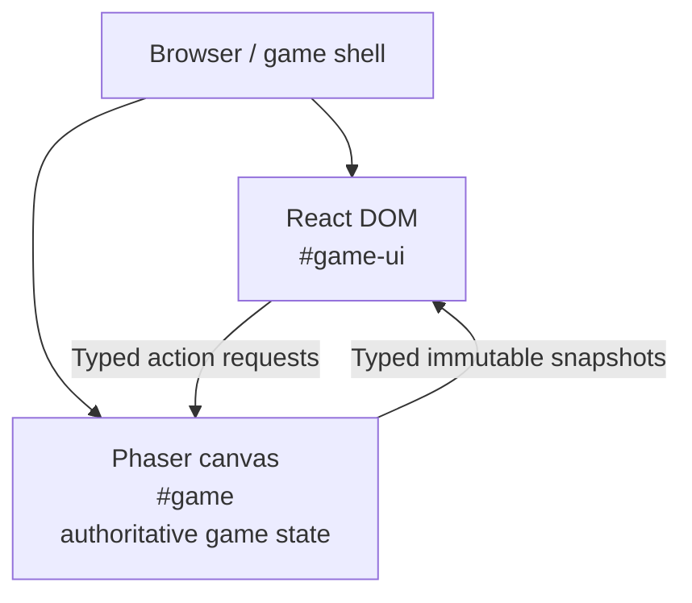

# Pirate Game

A browser-based pirate game with Phaser-driven gameplay and a React interface.

## Development

```sh
npm install
npm run dev
npm run build
npm run preview
```

## Architecture



- [React-Phaser UI Guidelines](docs/react-phaser-ui-guidelines.md)
